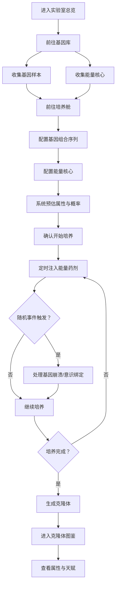

## 1. 产品概述

魔法世界克隆实验室是一款多人在线养成类Web应用，玩家在神秘的魔法世界中创建自己的克隆实验室，通过收集不同种族的基因样本与魔力能量核心，培养出具有独特属性与稀有天赋的克隆体。

- 核心目标：提供沉浸式的克隆体培养体验，融合基因组合策略、实时养成与随机事件系统
- 目标用户：喜爱养成、策略与收集类游戏的玩家
- 产品价值：通过深度的属性计算系统与随机事件机制，创造高自由度、高重玩价值的培养体验

## 2. 核心功能

### 2.1 用户角色

| 角色 | 注册方式 | 核心权限 |
|------|----------|----------|
| 玩家 | 自动创建演示账号 | 创建实验室、收集样本、培养克隆体、查看成就 |

### 2.2 功能模块

1. **实验室总览页面**：玩家信息、资源面板、培养舱状态、快捷操作入口
2. **基因库页面**：基因样本收集、能量核心存储、物品详情查看
3. **培养舱页面**：基因组合配置、培养参数设置、克隆体实时成长监控
4. **克隆体图鉴页面**：已培养克隆体列表、属性详情、天赋展示、状态管理

### 2.3 页面详情

| 页面名称 | 模块名称 | 功能描述 |
|----------|----------|----------|
| 实验室总览 | 玩家信息卡 | 展示研究员等级、经验、技能等级、金币、魔力值 |
| 实验室总览 | 资源面板 | 显示基因样本数量、能量核心存量、药剂库存 |
| 实验室总览 | 培养舱状态 | 展示当前正在培养的克隆体进度、成长度、同步率 |
| 实验室总览 | 事件通知 | 随机事件推送、培养完成提醒、异常状态警告 |
| 基因库 | 样本分类展示 | 按种族分类展示基因样本（人类、精灵、兽人、龙族、亡灵、魔族） |
| 基因库 | 能量核心库 | 展示各属性能量核心（火、水、风、土、光、暗、混沌） |
| 基因库 | 药剂仓库 | 各类能量药剂与催化剂展示 |
| 基因库 | 物品详情 | 查看物品稀有度、属性加成、获取来源 |
| 培养舱 | 基因插槽 | 三个按顺序排列的基因样本插槽 |
| 培养舱 | 能量核心配置 | 主能量核心与辅助能量核心配置区 |
| 培养舱 | 参数预览 | 预估基础属性、技能变异概率、稀有天赋概率 |
| 培养舱 | 培养进度 | 实时显示成长度、同步率、觉醒状态的动态进度条 |
| 培养舱 | 药剂注入 | 定时注入能量药剂，支持多种配方选择 |
| 培养舱 | 随机事件 | 培养过程中触发基因崩溃、意识绑定等事件 |
| 克隆体图鉴 | 克隆体列表 | 卡片式展示所有已培养克隆体 |
| 克隆体图鉴 | 属性雷达图 | 六维属性可视化展示（力量、敏捷、魔力、体质、感知、意志） |
| 克隆体图鉴 | 天赋技能 | 展示稀有天赋、技能列表与变异详情 |
| 克隆体图鉴 | 同步状态 | 显示与本体的意识同步率、绑定程度 |

## 3. 核心流程

玩家进入实验室后，首先在基因库中收集或查看已有的基因样本与能量核心，然后前往培养舱进行组合配置。系统根据基因搭配、能量浓度和研究员技能计算克隆体的基础属性与天赋概率。培养过程中需要定时注入能量药剂，并应对随机触发的基因崩溃或意识绑定事件。培养完成后，克隆体进入图鉴，玩家可查看其详细属性与稀有天赋。

## 4. 用户界面设计

### 4.1 设计风格

- **主色调**：深紫色系 (#1a0a2e, #2d1b4e, #6b21a8) 配合魔法蓝 (#3b82f6) 与魔力金 (#fbbf24) 点缀
- **次色调**：暗绿色 (#065f46) 代表生命能量，暗红色 (#991b1b) 代表警告与危险
- **按钮风格**：圆角魔法符文按钮，带有微光悬浮效果和脉冲动画
- **字体**：标题使用 Cinzel（魔法复古衬线体），正文使用 Cormorant Garamond（优雅衬线体）
- **布局风格**：深色玻璃拟态卡片布局，带有魔法粒子背景和动态光效
- **图标风格**：手绘魔法符文图标，配合发光边框与悬浮动画

### 4.2 页面设计概览

| 页面名称 | 模块名称 | UI元素 |
|----------|----------|--------|
| 实验室总览 | 整体布局 | 全屏背景为动态魔法粒子星空，顶部导航栏为半透明玻璃拟态，主区域分为左中右三栏 |
| 实验室总览 | 玩家信息卡 | 左侧竖向卡片，头像为魔法阵光效环绕，等级数字带金色光晕，属性条为渐变发光进度条 |
| 实验室总览 | 培养舱状态 | 中央大卡片，培养舱为3D立体容器效果，内部克隆体形态随进度变化，周围环绕能量流动光环 |
| 实验室总览 | 资源面板 | 右侧卡片，各资源以符文图标展示，数量数字带微发光效果，点击有涟漪扩散动画 |
| 基因库 | 分类标签 | 顶部横向标签，选中状态有底部魔法光条滑动动画，标签文字带符文装饰 |
| 基因库 | 样本卡片 | 网格布局，卡片有稀有度边框颜色（普通-灰、稀有-蓝、史诗-紫、传说-金），悬浮时卡片上浮并放大显示详情 |
| 培养舱 | 基因插槽 | 三个竖向排列的圆形插槽，插槽有魔法圆环动画，放入基因后显示样本预览与连接光束 |
| 培养舱 | 进度监控 | 三条发光进度条（成长度-绿、同步率-蓝、觉醒度-紫），数值实时跳动更新 |
| 培养舱 | 药剂注入区 | 药瓶图标，点击有倾倒动画，注入后进度条闪光线流过 |
| 克隆体图鉴 | 属性雷达图 | 六边形魔法阵为底的雷达图，数据区域半透明渐变填充，顶点有发光标记 |
| 克隆体图鉴 | 天赋展示 | 稀有天赋卡片带特殊边框光效，悬浮时显示详细说明，传说天赋有持续流光动画 |

### 4.3 响应式设计

- 桌面端优先：主布局采用三栏 240px - 1fr - 280px 结构
- 平板端（768px-1200px）：左右面板可折叠为抽屉式，主区域全宽展示
- 移动端（<768px）：单列垂直布局，顶部导航简化为图标按钮，培养舱简化展示

### 4.4 动效与交互

- 页面加载：魔法粒子从中心扩散，各模块卡片按 100ms 间隔渐入
- 培养舱能量流动：连续的光晕沿容器边缘循环流动
- 基因放入插槽：伴随魔法阵激活动画和连接光束
- 药剂注入：药瓶倾倒粒子效果，进度条光流冲刷
- 稀有天赋触发：全屏金色闪光，天赋卡片旋转出现
- 随机事件：屏幕边缘红光/绿光脉动，事件卡片从顶部滑入
