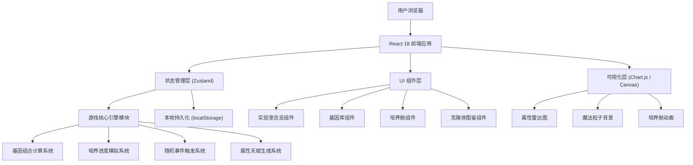
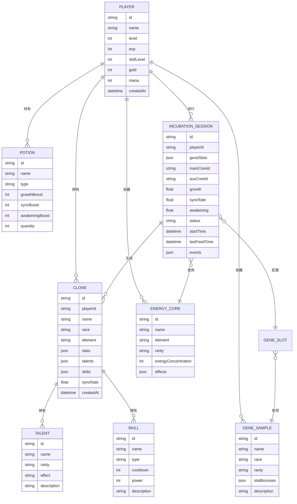

## 1. 架构设计



## 2. 技术描述

- **前端框架**：React 18 + TypeScript
- **构建工具**：Vite 5
- **样式方案**：TailwindCSS 3 + CSS Variables (主题系统)
- **状态管理**：Zustand (轻量级状态管理，适合游戏状态)
- **可视化**：Chart.js (雷达图) + 原生 Canvas API (粒子背景、培养舱动画)
- **路由**：React Router v6
- **图标**：Lucide React (配合自定义魔法风格 SVG)
- **字体**：Google Fonts (Cinzel, Cormorant Garamond)
- **后端**：无（单机演示版本，所有数据本地存储）
- **数据存储**：localStorage（持久化玩家进度）

## 3. 路由定义

| 路由 | 用途 |
|------|------|
| / | 实验室总览页面 - 玩家信息、资源、培养舱状态 |
| /gene-bank | 基因库页面 - 基因样本、能量核心、药剂 |
| /incubator | 培养舱页面 - 克隆体配置与实时培养 |
| /collection | 克隆体图鉴页面 - 已培养克隆体管理 |
| /arena | 克隆竞技大赛 - 组队、匹配、战斗、结算 |
| /market | 交易市场 - 挂单、购买、公告、价格建议 |
| /guild | 公会系统 - 工坊、同步塔、贡献、权限 |

## 4. 核心数据模型

### 4.1 数据模型定义



### 4.2 核心状态类型定义

```typescript
// 种族枚举
type Race = 'human' | 'elf' | 'orc' | 'dragon' | 'undead' | 'demon';

// 元素枚举
type Element = 'fire' | 'water' | 'wind' | 'earth' | 'light' | 'dark' | 'chaos';

// 稀有度枚举
type Rarity = 'common' | 'rare' | 'epic' | 'legendary';

// 培养状态枚举
type IncubationStatus = 'idle' | 'configuring' | 'cultivating' | 'completed' | 'failed';

// 六维属性
interface Stats {
  strength: number;
  agility: number;
  magic: number;
  constitution: number;
  perception: number;
  willpower: number;
}

// 基因样本
interface GeneSample {
  id: string;
  name: string;
  race: Race;
  rarity: Rarity;
  statBonuses: Partial<Stats>;
  traitBonus?: string;
  description: string;
  icon: string;
}

// 能量核心
interface EnergyCore {
  id: string;
  name: string;
  element: Element;
  rarity: Rarity;
  energyConcentration: number;
  effects: {
    statBoost?: Partial<Stats>;
    talentBonus?: number;
    mutationRate?: number;
  };
  description: string;
  icon: string;
}

// 药剂
interface Potion {
  id: string;
  name: string;
  type: 'growth' | 'sync' | 'awakening' | 'catalyst';
  rarity: Rarity;
  effects: {
    growthBoost: number;
    syncBoost: number;
    awakeningBoost: number;
    eventAlteration?: number;
  };
  quantity: number;
  description: string;
  icon: string;
}

// 天赋
interface Talent {
  id: string;
  name: string;
  rarity: Rarity;
  isRare: boolean;
  effect: string;
  statModifiers?: Partial<Stats>;
  description: string;
}

// 技能
interface Skill {
  id: string;
  name: string;
  type: 'active' | 'passive' | 'mutation';
  power: number;
  cooldown: number;
  description: string;
  isMutated: boolean;
}

// 培养会话
interface IncubationSession {
  id: string | null;
  status: IncubationStatus;
  geneSlots: [GeneSample | null, GeneSample | null, GeneSample | null];
  mainCore: EnergyCore | null;
  auxCore: EnergyCore | null;
  growth: number;
  syncRate: number;
  awakening: number;
  startTime: number | null;
  lastFeedTime: number | null;
  events: IncubationEvent[];
  estimatedStats: Stats | null;
  estimatedTalentChance: number;
  estimatedMutationChance: number;
}

// 培养事件
interface IncubationEvent {
  id: string;
  type: 'gene_crash' | 'consciousness_binding' | 'energy_surge' | 'mutation_trigger' | 'stable';
  timestamp: number;
  message: string;
  impact: {
    growth?: number;
    syncRate?: number;
    awakening?: number;
    talentBonus?: number;
  };
}

// 克隆体
interface Clone {
  id: string;
  name: string;
  race: Race;
  element: Element;
  rarity: Rarity;
  stats: Stats;
  talents: Talent[];
  skills: Skill[];
  syncRate: number;
  awakeningLevel: number;
  createdAt: number;
  isFavorite: boolean;
}

// 玩家状态
interface PlayerState {
  id: string;
  name: string;
  level: number;
  exp: number;
  skillLevel: number;
  gold: number;
  mana: number;
  geneSamples: GeneSample[];
  energyCores: EnergyCore[];
  potions: Potion[];
  clones: Clone[];
  currentSession: IncubationSession;
}
```

## 5. 核心算法模块

### 5.1 基因组合属性计算系统

- **基础属性公式**：根据三个基因插槽按权重（40%、35%、25%）叠加属性加成
- **能量浓度修正**：主核心提供 60% 元素加成，辅助核心提供 40%，计算能量浓度倍率
- **技能等级加成**：研究员技能等级每级提供 3% 属性加成和 1.5% 变异概率加成
- **种族协同效应**：同种族基因组合获得 15% 属性加成，跨种族特殊组合触发隐藏属性

### 5.2 培养进度模拟系统

- **时间因子**：基础成长速度 0.5%/秒，受药剂注入频率影响
- **同步率衰减**：超过 30 秒未注入药剂，同步率每秒下降 0.3%
- **觉醒累积**：同步率 > 80% 时觉醒度快速累积，< 50% 时停滞
- **事件触发概率**：基于成长阶段（0-30%: 5%，30-70%: 15%，70-100%: 25%）

### 5.3 天赋生成系统

- **稀有天赋池**：双倍感知、同步超载、基因共鸣、魔力虹吸、灵魂链接等
- **概率计算**：基础 10% + 能量核心加成 + 研究员技能加成 + 觉醒度修正
- **天赋品质**：普通(60%)、稀有(25%)、史诗(12%)、传说(3%)

## 6. 文件结构规划

```
src/
├── assets/
│   ├── fonts/
│   └── icons/
├── components/
│   ├── layout/
│   │   ├── Navbar.tsx
│   │   └── ParticleBackground.tsx
│   ├── lab/
│   │   ├── PlayerCard.tsx
│   │   ├── ResourcePanel.tsx
│   │   └── IncubatorStatus.tsx
│   ├── gene-bank/
│   │   ├── CategoryTabs.tsx
│   │   ├── GeneCard.tsx
│   │   ├── CoreCard.tsx
│   │   └── ItemDetailModal.tsx
│   ├── incubator/
│   │   ├── GeneSlot.tsx
│   │   ├── CoreSlot.tsx
│   │   ├── StatPreview.tsx
│   │   ├── ProgressMonitor.tsx
│   │   ├── PotionInjector.tsx
│   │   └── EventNotification.tsx
│   ├── collection/
│   │   ├── CloneCard.tsx
│   │   ├── StatRadar.tsx
│   │   ├── TalentDisplay.tsx
│   │   └── CloneDetailModal.tsx
│   ├── arena/
│   │   ├── TeamSetup.tsx
│   │   ├── MatchDisplay.tsx
│   │   ├── BattleScene.tsx
│   │   ├── SkillBar.tsx
│   │   ├── BattleLog.tsx
│   │   └── RewardPanel.tsx
│   ├── market/
│   │   ├── MarketTabs.tsx
│   │   ├── ListingCard.tsx
│   │   ├── SellModal.tsx
│   │   ├── PriceSuggestion.tsx
│   │   ├── AnnouncementBar.tsx
│   │   └── GeneRevolutionBanner.tsx
│   └── guild/
│       ├── GuildInfo.tsx
│       ├── BuildingCard.tsx
│       ├── ContributionPanel.tsx
│       ├── MemberList.tsx
│       ├── ApprovalPanel.tsx
│       └── PermissionSettings.tsx
├── store/
│   └── useGameStore.ts
├── engine/
│   ├── geneCalculator.ts
│   ├── incubationEngine.ts
│   ├── talentGenerator.ts
│   ├── eventSystem.ts
│   ├── battleEngine.ts
│   ├── tradeEngine.ts
│   └── guildEngine.ts
├── data/
│   ├── geneSamples.ts
│   ├── energyCores.ts
│   ├── potions.ts
│   ├── talents.ts
│   └── skills.ts
├── types/
│   └── index.ts
├── utils/
│   └── index.ts
├── pages/
│   ├── LabOverview.tsx
│   ├── GeneBank.tsx
│   ├── Incubator.tsx
│   ├── Collection.tsx
│   ├── Arena.tsx
│   ├── Market.tsx
│   └── Guild.tsx
├── App.tsx
├── main.tsx
└── index.css
```

## 7. 新增核心数据类型

### 7.1 竞技大赛类型

```typescript
// 战斗状态
type BattleStatus = 'idle' | 'team_setup' | 'matching' | 'battle' | 'finished';

// 主控对象
type BattleUnitType = 'player' | 'clone';

// 战斗单位
interface BattleUnit {
  id: string;
  type: BattleUnitType;
  name: string;
  race: Race;
  element: Element;
  maxHp: number;
  currentHp: number;
  stats: Stats;
  talents: Talent[];
  skills: Skill[];
  cooldowns: { [skillId: string]: number };
  syncRate: number;
  isActive: boolean;
}

// 战队
interface BattleTeam {
  player: BattleUnit;
  clones: BattleUnit[];
  activeUnitId: string;
  totalPower: number;
}

// 战斗日志
interface BattleLogEntry {
  id: string;
  timestamp: number;
  type: 'attack' | 'skill' | 'heal' | 'switch' | 'special' | 'system';
  source: string;
  target: string;
  message: string;
  damage?: number;
  heal?: number;
}

// 战斗奖励
interface BattleReward {
  points: number;
  geneFragments: { sample: GeneSample; quantity: number }[];
  gold: number;
  exp: number;
}

// 竞技状态
interface ArenaState {
  status: BattleStatus;
  selectedCloneIds: string[];
  myTeam: BattleTeam | null;
  enemyTeam: BattleTeam | null;
  battleLogs: BattleLogEntry[];
  currentRound: number;
  winner: 'player' | 'enemy' | null;
  reward: BattleReward | null;
  totalPoints: number;
  matchCount: number;
  winCount: number;
}
```

### 7.2 交易市场类型

```typescript
// 商品类型
type ListingType = 'clone' | 'gene';

// 挂单商品
interface MarketListing {
  id: string;
  sellerId: string;
  sellerName: string;
  type: ListingType;
  item: Clone | GeneSample;
  price: number;
  createdAt: number;
  expiresAt: number;
}

// 成交记录
interface TradeRecord {
  id: string;
  buyerId: string;
  buyerName: string;
  sellerId: string;
  sellerName: string;
  type: ListingType;
  itemName: string;
  itemRarity: Rarity;
  price: number;
  timestamp: number;
}

// 价格建议
interface PriceSuggestion {
  min: number;
  max: number;
  average: number;
  sevenDayAvg: number;
  trend: 'up' | 'down' | 'stable';
}

// 基因革命事件
interface GeneRevolutionEvent {
  id: string;
  startTime: number;
  endTime: number;
  successRateBonus: number;
  triggeredBy: string;
  itemName: string;
}

// 市场状态
interface MarketState {
  listings: MarketListing[];
  myListings: MarketListing[];
  tradeHistory: TradeRecord[];
  announcements: string[];
  geneRevolution: GeneRevolutionEvent | null;
}
```

### 7.3 公会系统类型

```typescript
// 公会职位
type GuildRank = 'president' | 'vice_president' | 'tech_officer' | 'member';

// 权限定义
interface GuildPermissions {
  canApproveJoin: boolean;
  canKickMember: boolean;
  canEditInfo: boolean;
  canUpgradeBuilding: boolean;
  canManagePermissions: boolean;
}

// 公会成员
interface GuildMember {
  id: string;
  name: string;
  rank: GuildRank;
  permissions: GuildPermissions;
  contribution: {
    gold: number;
    materials: number;
    total: number;
  };
  joinDate: number;
  lastActive: number;
}

// 公会建筑
interface GuildBuilding {
  id: 'cloning_workshop' | 'sync_tower';
  name: string;
  level: number;
  currentExp: number;
  requiredExp: number;
  bonus: {
    successRate: number;
    syncEfficiency: number;
  };
  description: string;
}

// 入会申请
interface GuildJoinRequest {
  id: string;
  playerId: string;
  playerName: string;
  playerLevel: number;
  message: string;
  timestamp: number;
}

// 公会状态
interface GuildState {
  id: string | null;
  name: string | null;
  level: number;
  announcement: string;
  members: GuildMember[];
  buildings: GuildBuilding[];
  joinRequests: GuildJoinRequest[];
  myRank: GuildRank | null;
  myPermissions: GuildPermissions | null;
}
```

## 8. 新增核心引擎

### 8.1 战斗引擎 (battleEngine.ts)

- **calculateTeamPower(team: BattleTeam): number** - 综合战力计算
- **findMatch(myTeam: BattleTeam): BattleTeam** - 自动匹配对手
- **createBattleUnit(source: Player | Clone, type: BattleUnitType): BattleUnit** - 创建战斗单位
- **processBattleTick(battle: BattleState): BattleState** - 每帧战斗逻辑
- **executeSkill(attacker: BattleUnit, skill: Skill, target: BattleUnit, battle: BattleState): { damage: number; log: BattleLogEntry }** - 技能执行
- **switchActiveUnit(team: BattleTeam, newUnitId: string): BattleTeam** - 切换主控
- **useConsciousnessTransfer(team: BattleTeam): BattleTeam** - 意识转移技能
- **useGeneBurst(team: BattleTeam, target: BattleUnit): { damage: number; logs: BattleLogEntry[] }** - 基因爆发技能
- **calculateReward(winner: 'player' | 'enemy', battle: BattleState): BattleReward** - 奖励计算

### 8.2 交易引擎 (tradeEngine.ts)

- **createListing(seller: Player, item: Clone | GeneSample, price: number): MarketListing** - 创建挂单
- **cancelListing(listingId: string, sellerId: string): boolean** - 撤销挂单
- **getPriceSuggestion(item: Clone | GeneSample, history: TradeRecord[]): PriceSuggestion** - 价格建议
- **executeTrade(buyer: Player, listing: MarketListing): { success: boolean; record: TradeRecord | null }** - 执行交易
- **checkGeneRevolution(records: TradeRecord[]): GeneRevolutionEvent | null** - 检查基因革命触发
- **getSevenDayAverage(itemType: string, rarity: Rarity, history: TradeRecord[]): number** - 7天均价

### 8.3 公会引擎 (guildEngine.ts)

- **createGuild(president: Player, name: string): GuildState** - 创建公会
- **requestJoin(guildId: string, player: Player, message: string): GuildJoinRequest** - 申请入会
- **approveJoin(request: GuildJoinRequest, member: GuildMember): boolean** - 审批入会
- **contributeResources(memberId: string, gold: number, materials: number): { buildings: GuildBuilding[]; member: GuildMember }** - 贡献升级
- **upgradeBuilding(building: GuildBuilding): GuildBuilding** - 建筑升级
- **getPermissionsByRank(rank: GuildRank): GuildPermissions** - 根据职位获取权限
- **setMemberRank(memberId: string, newRank: GuildRank, operator: GuildMember): GuildMember | null** - 设置成员职位
- **getGuildBonuses(guild: GuildState): { successRateBonus: number; syncBonus: number }** - 获取公会加成
```
